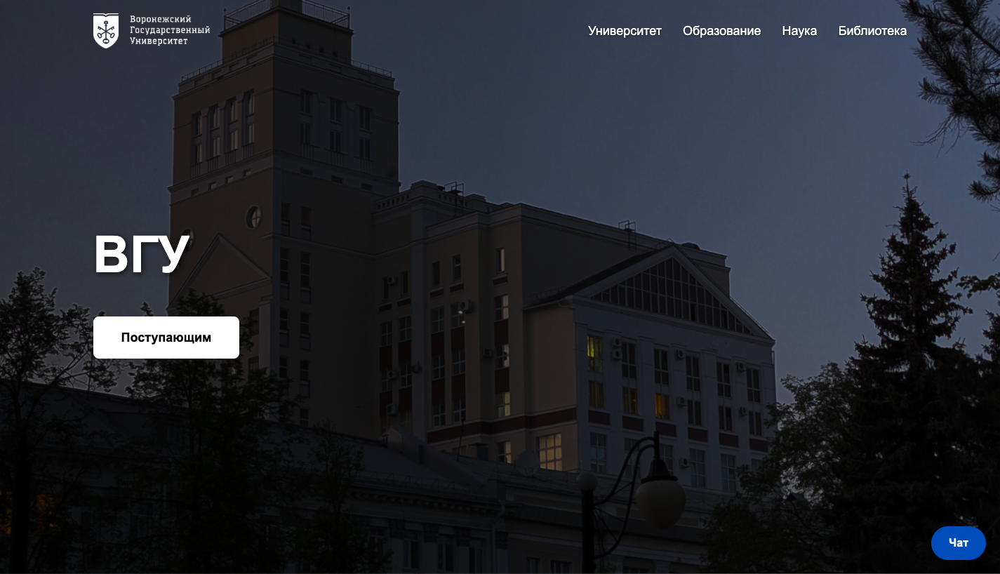
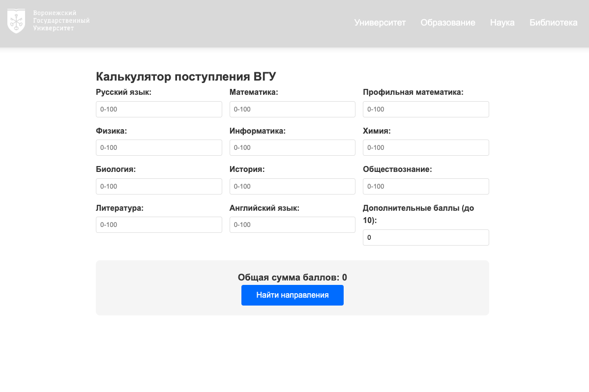

# ВГУ 2.0

**Современная образовательная платформа для студентов и преподавателей**

 <!-- Добавите позже -->

## 🎯 О проекте

ВГУ 2.0 — это инновационная образовательная экосистема, которая преобразует традиционный учебный процесс в цифровой формат. Платформа объединяет студентов, преподавателей и учебные материалы в едином пространстве.

**Основные возможности:**
- 📚 Интерактивные учебные курсы
- 💬 Встроенная система коммуникации
- 📊 Личный кабинет с прогрессом обучения
- 🗞️ Новостная лента университета
- 🧮 Инструменты для расчетов и аналитики

## 🛠 Технологии

### Frontend
- **React** - современный фреймворк для построения пользовательских интерфейсов
- **Vite** - быстрый сборщик проекта
- **React Router Dom** - обеспечение качества кода

### Backend
- **Django** - мощный Python фреймворк
- **Django REST Framework** - создание API
- **SQLite** - база данных для разработки

## 🚀 Быстрый старт

### Предварительные требования
- Python 3.8+
- Node.js 16+
- npm или yarn

### Установка и запуск

1. **Клонирование репозитория**
```bash
git clone https://github.com/troff-vicc/eclips
cd eclips
```

2. **Настройка бэкенда**
```bash
cd backend
pip install -r requirements.txt
python manage.py migrate
python manage.py runserver
```
Бэкенд будет доступен по адресу: `http://localhost:8000`

3. **Настройка фронтенда**
```bash
cd frontend
npm install
npm run dev
```
Фронтенд будет доступен по адресу: `http://localhost:5173`

## 📸 Скриншоты





## 📁 Структура проекта

```
eclips/
├── backend/          # Django приложение
│   ├── core/         # Основное приложение
│   ├── chat/         # Модуль чата
│   ├── news/         # Новостной модуль
│   ├── calculator/   # Расчетный модуль
│   └── requirements.txt
├── frontend/         # React приложение
│   ├── src/
│   ├── public/
│   └── package.json
├── docs/             # Документация
│   └── assets/       # Медиафайлы
└── README.md
```

## 👥 Команда

- **Вкитор** - Full-Stack разработчик
- **Илья** - Менеджер
- **Александра** - Дизайнер

## 📄 Лицензия

Этот проект создан в рамках хакатона Моя профессия ИТ.

---

**ВГУ 2.0 - Образование будущего уже сегодня!** 🎓